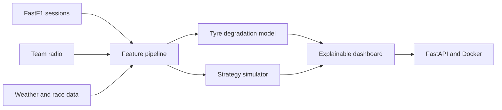

# Race Engineer AI

> Explainable F1 strategy and telemetry intelligence.

[](https://www.python.org/)
[](https://fastapi.tiangolo.com/)
[](https://docs.fastf1.dev/)
[](https://pandas.pydata.org/)
[](https://numpy.org/)
[](https://www.docker.com/)
[](tests/)

Race Engineer AI is an explainable F1 strategy workbench. It loads historical
FastF1 sessions, turns them into leakage-safe lap features, compares pit-now
and stay-out counterfactuals, replays decisions lap by lap, and exposes the
evidence through a FastAPI service and browser dashboard.

## Current status

The current release is a transparent, reproducible MVP: it uses real 2024
Monza race data and clearly labels baseline assumptions, estimated
degradation, marginal calls, and backtest results.

## Run it locally

```bash
python3 -m venv .venv
source .venv/bin/activate
pip install -e '.[dev]'
pytest
uvicorn race_engineer.api:app --reload
```

Then open `http://127.0.0.1:8000/docs` and try `POST /strategy/recommend`.
The `POST /strategy/compare` endpoint compares the two race counterfactuals.
The `POST /strategy/replay` endpoint applies that decision logic to observed
laps and returns a lap-by-lap recommendation stream.
Open `http://127.0.0.1:8000/dashboard` for the visual dashboard. The root URL
(`http://127.0.0.1:8000/`) opens the same page.
The dashboard also checks `GET /data/summary` to report whether the processed
Monza session is available locally.
`GET /data/laps?driver=VER` returns a bounded lap sample used by the telemetry
preview chart.
`GET /data/context?driver=VER&lap=40` returns an accurate mid-race lap for the
strategy form defaults.

Example request:

```json
{
  "current_lap": 40,
  "total_laps": 57,
  "tyre_age": 18,
  "pit_loss_seconds": 22,
  "degradation_seconds_per_lap": 0.08
}
```

## Planned system



The data pipeline will use cached downloads and time-aware evaluation to avoid
using future laps when making a decision about the current lap. Raw datasets
will stay outside Git; the repository will contain reproducible download and
feature-building scripts with dataset attribution.

The current backtest evaluates the transparent counterfactual baseline; it is
not a claim of race-winning performance. Weather and team-radio evidence are
the next multimodal extension because they require additional licensed data
and careful time alignment.

## Roadmap

- [x] Testable baseline strategy rule
- [x] Health check and recommendation API
- [x] FastF1 session ingestion and caching
- [x] Leakage-safe lap feature table and download script
- [x] Interpretable tyre-degradation baseline
- [x] Counterfactual pit-now versus stay-out simulator
- [x] Lap-by-lap strategy replay endpoint
- [x] First visual strategy dashboard
- [x] Processed race-data status in dashboard
- [x] Real processed lap sample and pace trace
- [x] Driver-aware strategy form defaults
- [x] Tyre degradation features and race-level backtesting
- [x] Counterfactual pit-stop simulator
- [x] Telemetry evidence in explanations
- [ ] Weather and team-radio evidence in explanations
- [x] Interactive dashboard
- [x] Docker image definition and production run path

## Project map

- `src/race_engineer/models.py` — request and recommendation contracts
- `src/race_engineer/strategy.py` — transparent baseline decision logic
- `src/race_engineer/api.py` — FastAPI application
- `src/race_engineer/data.py` — optional FastF1 loading and lap features
- `src/race_engineer/degradation.py` — compound-level degradation model
- `src/race_engineer/simulation.py` — counterfactual strategy comparison
- `src/race_engineer/replay.py` — lap-by-lap replay logic
- `src/race_engineer/frontend.py` — browser dashboard
- `scripts/download_session.py` — reproducible session download command
- `scripts/fit_degradation.py` — fit and export degradation coefficients
- `src/race_engineer/backtest.py` — time-aware strategy backtesting
- `scripts/backtest_session.py` — reproducible backtest command
- `tests/` — behaviour tests for the first vertical slice

Download a first session after installing the data extras:

```bash
pip install -e '.[data]'
python scripts/download_session.py --year 2024 --event Monza --session R
python scripts/fit_degradation.py data/processed/laps.parquet
python scripts/backtest_session.py data/processed/monza_2024_race.parquet
```

The live verification run exercised `/`, `/health`, `/data/summary`,
`/data/laps`, `/data/context`, `/evaluation/backtest`, and
`POST /strategy/compare`; all returned successfully against the downloaded
2024 Monza session. Docker is defined in `Dockerfile`; the current machine did
not have the Docker CLI installed, so image construction must be run on a host
with Docker.
