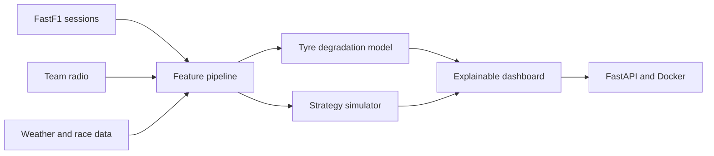

# Race Engineer AI

> Explainable F1 strategy and telemetry intelligence.

Race Engineer AI is a production-minded project that replays historical races,
estimates tyre degradation, compares pit-stop strategies, and explains its
recommendations with evidence from telemetry, weather, and team radio.

## Current status

The repository starts with a transparent strategy baseline and a FastAPI
endpoint. This gives us a working vertical slice before we add historical F1
data and machine-learning models.

## Run it locally

```bash
python3 -m venv .venv
source .venv/bin/activate
pip install -e '.[dev]'
pytest
uvicorn race_engineer.api:app --reload
```

Then open `http://127.0.0.1:8000/docs` and try `POST /strategy/recommend`.
The `POST /strategy/compare` endpoint compares the two race counterfactuals.
The `POST /strategy/replay` endpoint applies that decision logic to observed
laps and returns a lap-by-lap recommendation stream.
Open `http://127.0.0.1:8000/dashboard` for the visual dashboard. The root URL
(`http://127.0.0.1:8000/`) opens the same page.
The dashboard also checks `GET /data/summary` to report whether the processed
Monza session is available locally.
`GET /data/laps?driver=VER` returns a bounded lap sample used by the telemetry
preview chart.
`GET /data/context?driver=VER&lap=40` returns an accurate mid-race lap for the
strategy form defaults.

Example request:

```json
{
  "current_lap": 40,
  "total_laps": 57,
  "tyre_age": 18,
  "pit_loss_seconds": 22,
  "degradation_seconds_per_lap": 0.08
}
```

## Planned system



The data pipeline will use cached downloads and time-aware evaluation to avoid
using future laps when making a decision about the current lap. Raw datasets
will stay outside Git; the repository will contain reproducible download and
feature-building scripts with dataset attribution.

## Roadmap

- [x] Testable baseline strategy rule
- [x] Health check and recommendation API
- [ ] FastF1 session ingestion and caching
- [x] Leakage-safe lap feature table and download script
- [x] Interpretable tyre-degradation baseline
- [x] Counterfactual pit-now versus stay-out simulator
- [x] Lap-by-lap strategy replay endpoint
- [x] First visual strategy dashboard
- [x] Processed race-data status in dashboard
- [x] Real processed lap sample and pace trace
- [x] Driver-aware strategy form defaults
- [ ] Tyre degradation features and race-level backtesting
- [ ] Counterfactual pit-stop simulator
- [ ] Telemetry, weather, and team-radio evidence in explanations
- [ ] Interactive dashboard, Docker image, and deployment

## Project map

- `src/race_engineer/models.py` — request and recommendation contracts
- `src/race_engineer/strategy.py` — transparent baseline decision logic
- `src/race_engineer/api.py` — FastAPI application
- `src/race_engineer/data.py` — optional FastF1 loading and lap features
- `src/race_engineer/degradation.py` — compound-level degradation model
- `src/race_engineer/simulation.py` — counterfactual strategy comparison
- `src/race_engineer/replay.py` — lap-by-lap replay logic
- `src/race_engineer/frontend.py` — browser dashboard
- `scripts/download_session.py` — reproducible session download command
- `scripts/fit_degradation.py` — fit and export degradation coefficients
- `tests/` — behaviour tests for the first vertical slice

Download a first session after installing the data extras:

```bash
pip install -e '.[data]'
python scripts/download_session.py --year 2024 --event Monza --session R
python scripts/fit_degradation.py data/processed/laps.parquet
```
