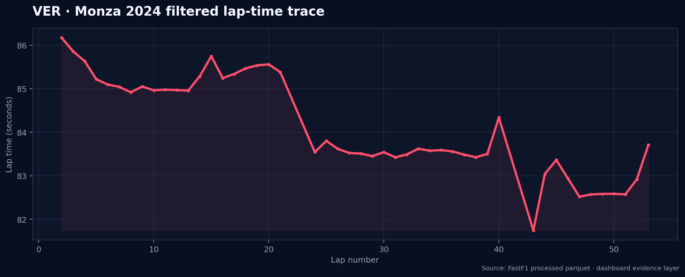
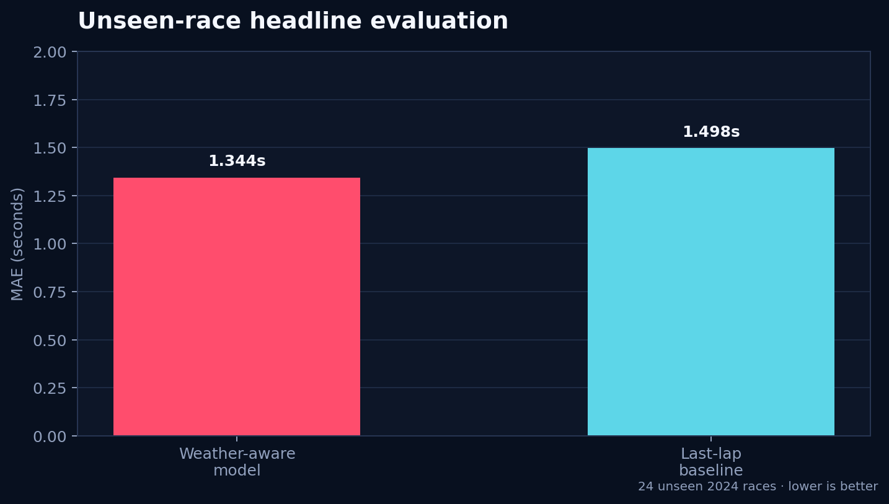
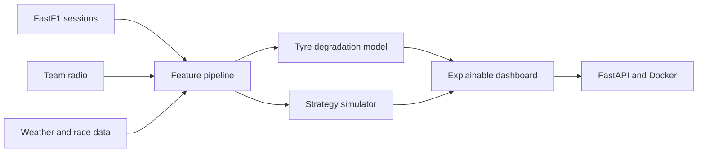

<div align="center">
  
</div>

# Race Engineer AI

> Explainable F1 strategy and telemetry intelligence.

[](https://www.python.org/)
[](https://fastapi.tiangolo.com/)
[](https://docs.fastf1.dev/)
[](https://pandas.pydata.org/)
[](https://numpy.org/)
[](https://github.com/Yass149/f1-strategy/actions/workflows/ci.yml)

Race Engineer AI is an explainable F1 strategy workbench. It loads historical
FastF1 sessions, turns them into time-aware lap features, compares pit-now
and stay-out counterfactuals, replays decisions lap by lap, and exposes the
evidence through a FastAPI service and browser dashboard.

## Current status

The current release is a transparent, reproducible MVP: it uses real 2024
Monza race data and clearly labels baseline assumptions, estimated
degradation, marginal calls, and backtest results.

**Headline evaluation:** future stint lap-time MAE on 24 unseen 2024 races is
**1.344 seconds**, compared with **1.498 seconds** for the last-lap baseline.
Lower MAE is better: this is a **0.154-second mean improvement** over the
baseline, and the model wins in **11 of 24 races** at cutoff lap 20. This is
evidence about lap-time prediction only; it does not show that the pit-stop
recommendations improve finishing position or race outcomes. The project
remains a research prototype.

## Visual evidence

The dashboard is built around evidence that can be inspected rather than a single opaque score. This is a real filtered lap-time trace from the processed Monza parquet file:



The headline evaluation is deliberately shown alongside the simple last-lap
baseline. The chart below reflects the cutoff-lap-20 values from the
reproducible season evaluation. Running `scripts/evaluate_season.py` writes
the detailed report to `artifacts/season_2024_weather_evaluation.json`:



These images are generated from the repository data and evaluation run; they
are not mock product screenshots.

## Run it locally

```bash
python3 -m venv .venv
source .venv/bin/activate
pip install -e '.[dev,data]'
pytest
uvicorn race_engineer.api:app --reload
```

To rebuild the dashboard’s Monza data with timestamp-safe weather:

```bash
python scripts/download_session.py --year 2024 --event Monza --session R \
  --output data/processed/monza_2024_weather.parquet
```

To regenerate the full-season evaluation at multiple decision cutoffs:

```bash
python scripts/download_season.py --year 2024 \
  --output-dir data/processed/season_2024_weather
python scripts/evaluate_season.py data/processed/season_2024_weather \
  --cutoffs 20,30,40 --cutoff-lap 20 \
  --output artifacts/season_2024_weather_evaluation.json
```

Then open `http://127.0.0.1:8000/docs` and try `POST /strategy/recommend`.
The `POST /strategy/compare` endpoint compares the two race counterfactuals.
The `POST /strategy/windows` endpoint searches legal pit windows and enforces
two different dry-weather compounds.
The `POST /strategy/replay` endpoint applies that decision logic to observed
laps and returns a lap-by-lap recommendation stream.
Open `http://127.0.0.1:8000/dashboard` for the visual dashboard. The root URL
(`http://127.0.0.1:8000/`) opens the same page.
The dashboard also checks `GET /data/summary` to report whether the processed
Monza session is available locally.
`GET /data/laps?driver=VER` returns a bounded lap sample used by the telemetry
preview chart.
`GET /data/context?driver=VER&lap=40` returns an accurate mid-race lap for the
strategy form defaults.

Example request:

```json
{
  "current_lap": 40,
  "total_laps": 57,
  "tyre_age": 18,
  "pit_loss_seconds": 22,
  "degradation_seconds_per_lap": 0.08
}
```

## Planned system


```mermaid
flowchart LR
  A[FastF1 sessions] --> B[Feature pipeline]
  C[Team radio] --> B
  D[Weather and race data] --> B
  B --> E[Tyre degradation model]
  B --> F[Strategy simulator]
  E --> G[Explainable dashboard]
  F --> G
  G --> H[FastAPI and Docker]
```

The data pipeline uses cached downloads and time-aware evaluation. For each
held-out race, the evaluator fits on the other races plus all drivers' laps
from the held-out race available up to the selected cutoff, then scores only
later laps from that race. The
last-lap-repeat baseline uses the same information available at the cutoff.
The model's `calibration_alpha` is a bounded scalar for point-prediction
adjustment learned from pre-cutoff laps; it is not a probability and the
evaluation is not a Monte Carlo simulation. Raw datasets stay outside Git;
the repository contains reproducible download and feature-building scripts
with dataset attribution.

The current backtest evaluates future lap-time prediction and the dashboard
also exposes transparent pit-stop counterfactuals. Neither result is a claim
of race-winning performance. Timestamp-safe weather is included in the
current evaluation; team-radio evidence remains a future multimodal extension
because it requires additional licensed data and careful time alignment.

## Roadmap

- [x] Testable baseline strategy rule
- [x] Health check and recommendation API
- [x] FastF1 session ingestion and caching
- [x] Leakage-safe lap feature table and download script
- [x] Interpretable tyre-degradation baseline
- [x] Counterfactual pit-now versus stay-out simulator
- [x] Lap-by-lap strategy replay endpoint
- [x] First visual strategy dashboard
- [x] Processed race-data status in dashboard
- [x] Real processed lap sample and pace trace
- [x] Driver-aware strategy form defaults
- [x] Tyre degradation features and race-level backtesting
- [x] Counterfactual pit-stop simulator
- [x] Legal pit-window search with dry-race compound rule
- [x] Processed telemetry and timestamp-safe weather context in explanations
- [ ] Team-radio evidence in explanations
- [x] Interactive dashboard
- [x] Dockerfile and production run path (build locally where Docker is available)

## Project map

- `src/race_engineer/models.py` — request and recommendation contracts
- `src/race_engineer/strategy.py` — transparent baseline decision logic
- `src/race_engineer/api.py` — FastAPI application
- `src/race_engineer/data.py` — optional FastF1 loading and lap features
- `src/race_engineer/degradation.py` — compound-level degradation model
- `src/race_engineer/simulation.py` — counterfactual strategy comparison
- `POST /strategy/windows` — legal pit-window search
- `src/race_engineer/replay.py` — lap-by-lap replay logic
- `src/race_engineer/frontend.py` — browser dashboard
- `scripts/download_session.py` — reproducible session download command
- `scripts/fit_degradation.py` — fit and export degradation coefficients
- `src/race_engineer/backtest.py` — time-aware strategy backtesting
- `scripts/backtest_session.py` — reproducible backtest command
- `scripts/download_season.py` — download all race sessions for a season
- `scripts/evaluate_season.py` — leave-one-race-out evaluation
- `tests/` — behaviour tests for the first vertical slice

Download a first session after installing the data extras:

```bash
pip install -e '.[data]'
python scripts/download_session.py --year 2024 --event Monza --session R
python scripts/fit_degradation.py data/processed/laps.parquet
python scripts/backtest_session.py data/processed/monza_2024_race.parquet
```

## Engineering checks

The repository is continuously checked with the same commands used locally:

```bash
pytest -q                 # project behaviour and data-contract tests
ruff check src tests scripts
```

The headline metric is intentionally a comparison against a simple baseline.
The current model improves mean future-lap MAE at cutoff lap 20, while the
per-race result is mixed (11 wins out of 24). Improving generalisation across
circuits remains an explicit research objective rather than a race-outcome
claim.

The live verification run exercised `/`, `/health`, `/data/summary`,
`/data/laps`, `/data/context`, `/evaluation/backtest`, and
`POST /strategy/compare`; all returned successfully against the downloaded
2024 Monza session. Docker is defined in `Dockerfile`; the current machine did
not have the Docker CLI installed, so image construction must be run on a host
with Docker.
